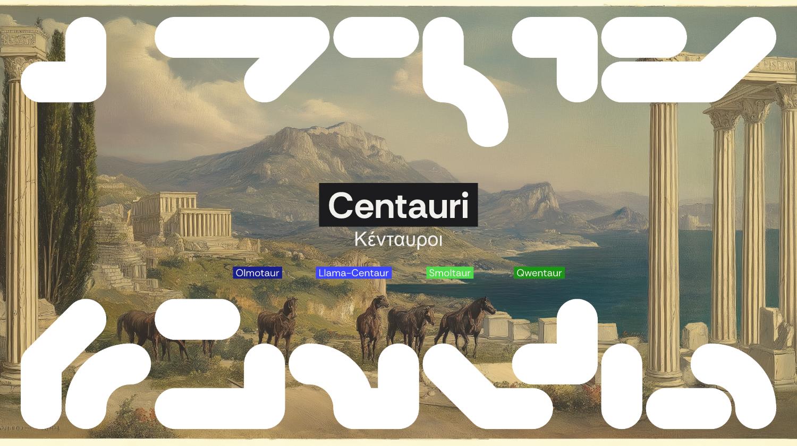
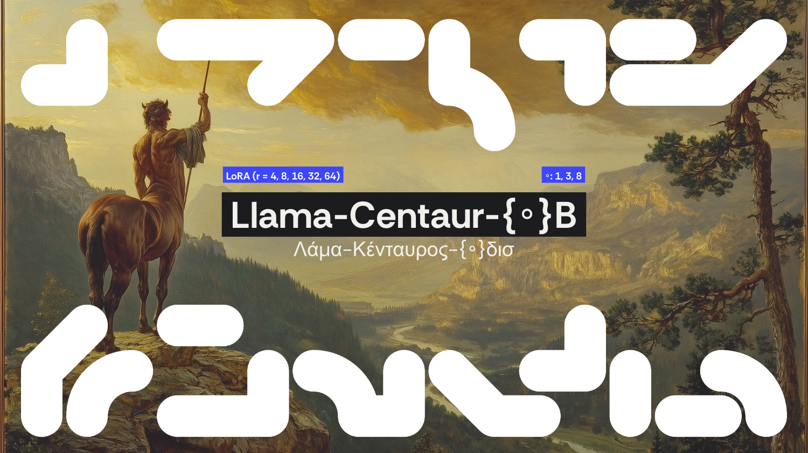
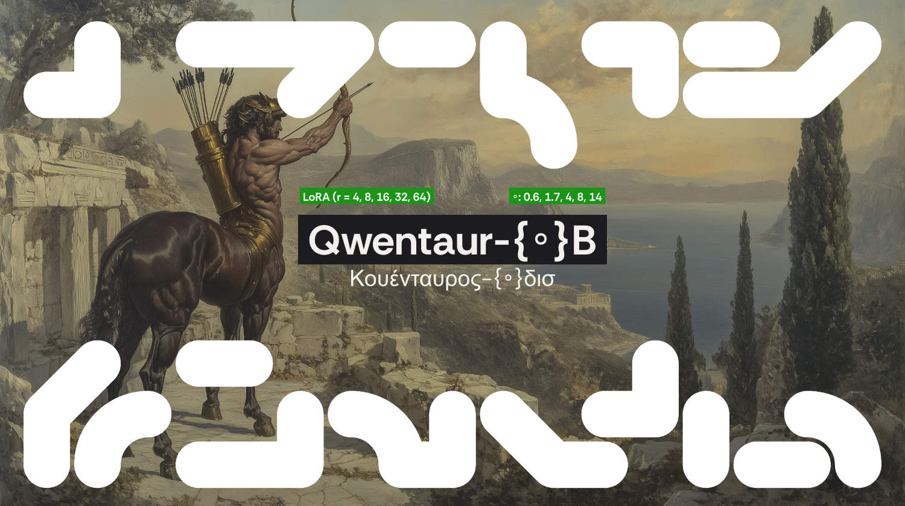
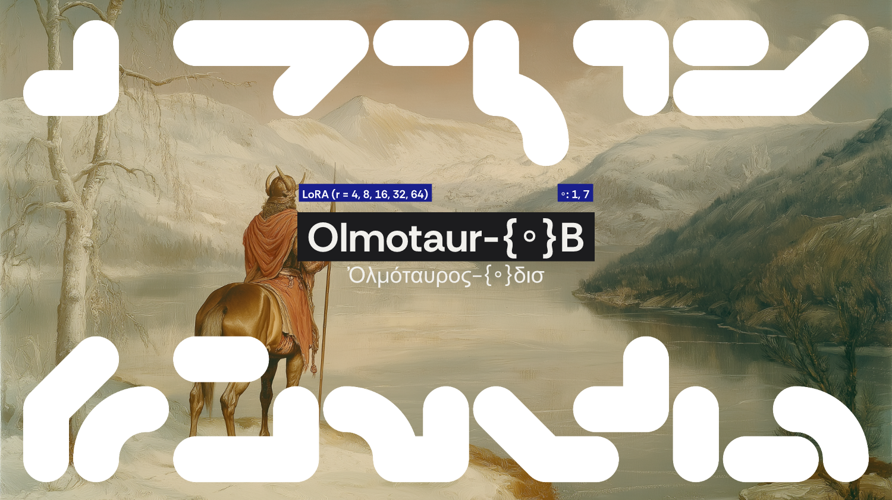

<div align="center">
  

  [![socius](https://img.shields.io/badge/Models-socius-00002E?logo=data:image/svg%2bxml;base64,PHN2ZyB3aWR0aD0iMzAwIiBoZWlnaHQ9IjMwMCIgdmlld0JveD0iMCAwIDMwMCAzMDAiIGZpbGw9Im5vbmUiIHhtbG5zPSJodHRwOi8vd3d3LnczLm9yZy8yMDAwL3N2ZyI+CjxwYXRoIGZpbGwtcnVsZT0iZXZlbm9kZCIgY2xpcC1ydWxlPSJldmVub2RkIiBkPSJNMTkxIDQyQzE5MSAzNC44MjAzIDE5Ni44MiAyOSAyMDQgMjlMMjU4IDI5QzI2NS4xOCAyOSAyNzEgMzQuODIwMyAyNzEgNDJDMjcxIDQ5LjE3OTcgMjY1LjE4IDU1IDI1OCA1NUwyMDQgNTVDMTk2LjgyIDU1IDE5MSA0OS4xNzk3IDE5MSA0MloiIGZpbGw9IiNGMUYwRUMiLz4KPHBhdGggZmlsbC1ydWxlPSJldmVub2RkIiBjbGlwLXJ1bGU9ImV2ZW5vZGQiIGQ9Ik00MiAxMDlDMzQuODIwMyAxMDkgMjkgMTAzLjE4IDI5IDk2TDI5IDQyQzI5IDM0LjgyMDMgMzQuODIwMyAyOSA0MiAyOUM0OS4xNzk3IDI5IDU1IDM0LjgyMDMgNTUgNDJMNTUgOTZDNTUgMTAzLjE4IDQ5LjE3OTcgMTA5IDQyIDEwOVoiIGZpbGw9IiNGMUYwRUMiLz4KPHBhdGggZmlsbC1ydWxlPSJldmVub2RkIiBjbGlwLXJ1bGU9ImV2ZW5vZGQiIGQ9Ik0yNTggMTkxQzI2NS4xOCAxOTEgMjcxIDE5Ni44MiAyNzEgMjA0TDI3MSAyNThDMjcxIDI2NS4xOCAyNjUuMTggMjcxIDI1OCAyNzFDMjUwLjgyIDI3MSAyNDUgMjY1LjE4IDI0NSAyNThMMjQ1IDIwNEMyNDUgMTk2LjgyIDI1MC44MiAxOTEgMjU4IDE5MVoiIGZpbGw9IiNGMUYwRUMiLz4KPHBhdGggZmlsbC1ydWxlPSJldmVub2RkIiBjbGlwLXJ1bGU9ImV2ZW5vZGQiIGQ9Ik0xMDkgMjU4QzEwOSAyNjUuMTggMTAzLjE4IDI3MSA5NiAyNzFMNDIgMjcxQzM0LjgyMDMgMjcxIDI5IDI2NS4xOCAyOSAyNThDMjkgMjUwLjgyIDM0LjgyMDMgMjQ1IDQyIDI0NUw5NiAyNDVDMTAzLjE4IDI0NSAxMDkgMjUwLjgyIDEwOSAyNThaIiBmaWxsPSIjRjFGMEVDIi8+CjxwYXRoIGZpbGwtcnVsZT0iZXZlbm9kZCIgY2xpcC1ydWxlPSJldmVub2RkIiBkPSJNMjkgOTZDMjkgODguODIwMyAzNC44MjAzIDgzIDQyIDgzTDk2IDgzQzEwMy4xOCA4MyAxMDkgODguODIwMyAxMDkgOTZDMTA5IDEwMy4xOCAxMDMuMTggMTA5IDk2IDEwOUw0MiAxMDlDMzQuODIwMyAxMDkgMjkgMTAzLjE4IDI5IDk2WiIgZmlsbD0iI0YxRjBFQyIvPgo8cGF0aCBmaWxsLXJ1bGU9ImV2ZW5vZGQiIGNsaXAtcnVsZT0iZXZlbm9kZCIgZD0iTTIwNCA4M0MyMTEuMTggODMgMjE3IDg4LjgyMDMgMjE3IDk2TDIxNyAxNTBDMjE3IDE1Ny4xOCAyMTEuMTggMTYzIDIwNCAxNjNDMTk2LjgyIDE2MyAxOTEgMTU3LjE4IDE5MSAxNTBMMTkxIDk2QzE5MSA4OC44MjAzIDE5Ni44MiA4MyAyMDQgODNaIiBmaWxsPSIjRjFGMEVDIi8+CjxwYXRoIGZpbGwtcnVsZT0iZXZlbm9kZCIgY2xpcC1ydWxlPSJldmVub2RkIiBkPSJNMjcxIDIwNEMyNzEgMjExLjE4IDI2NS4xOCAyMTcgMjU4IDIxN0wyMDQgMjE3QzE5Ni44MiAyMTcgMTkxIDIxMS4xOCAxOTEgMjA0QzE5MSAxOTYuODIgMTk2LjgyIDE5MSAyMDQgMTkxTDI1OCAxOTFDMjY1LjE4IDE5MSAyNzEgMTk2LjgyIDI3MSAyMDRaIiBmaWxsPSIjRjFGMEVDIi8+CjxwYXRoIGZpbGwtcnVsZT0iZXZlbm9kZCIgY2xpcC1ydWxlPSJldmVub2RkIiBkPSJNOTYgMjE3Qzg4LjgyMDMgMjE3IDgzIDIxMS4xOCA4MyAyMDRMODMgMTUwQzgzIDE0Mi44MiA4OC44MjAzIDEzNyA5NiAxMzdDMTAzLjE4IDEzNyAxMDkgMTQyLjgyIDEwOSAxNTBMMTA5IDIwNEMxMDkgMjExLjE4IDEwMy4xOCAyMTcgOTYgMjE3WiIgZmlsbD0iI0YxRjBFQyIvPgo8cGF0aCBmaWxsLXJ1bGU9ImV2ZW5vZGQiIGNsaXAtcnVsZT0iZXZlbm9kZCIgZD0iTTI1OCA4M0MyNjUuMTggODMgMjcxIDg4LjgyMDMgMjcxIDk2QzI3MSAxMzMuMDAyIDI0MS4wMDIgMTYzIDIwNCAxNjNDMTk2LjgyIDE2MyAxOTEgMTU3LjE4IDE5MSAxNTBDMTkxIDE0Mi44MiAxOTYuODIgMTM3IDIwNCAxMzdDMjI2LjY0MiAxMzcgMjQ1IDExOC42NDIgMjQ1IDk2QzI0NSA4OC44MjAzIDI1MC44MiA4MyAyNTggODNaIiBmaWxsPSIjRjFGMEVDIi8+CjxwYXRoIGZpbGwtcnVsZT0iZXZlbm9kZCIgY2xpcC1ydWxlPSJldmVub2RkIiBkPSJNODMgNDJDODMgMzQuODIwMyA4OC44MjAzIDI5IDk2IDI5QzEzMy4wMDIgMjkgMTYzIDU4Ljk5ODEgMTYzIDk2QzE2MyAxMDMuMTggMTU3LjE4IDEwOSAxNTAgMTA5QzE0Mi44MiAxMDkgMTM3IDEwMy4xOCAxMzcgOTZDMTM3IDczLjM1NzUgMTE4LjY0MiA1NSA5NiA1NUM4OC44MjAzIDU1IDgzIDQ5LjE3OTcgODMgNDJaIiBmaWxsPSIjRjFGMEVDIi8+CjxwYXRoIGZpbGwtcnVsZT0iZXZlbm9kZCIgY2xpcC1ydWxlPSJldmVub2RkIiBkPSJNMjE3IDI1OEMyMTcgMjY1LjE4IDIxMS4xOCAyNzEgMjA0IDI3MUMxNjYuOTk4IDI3MSAxMzcgMjQxLjAwMiAxMzcgMjA0QzEzNyAxOTYuODIgMTQyLjgyIDE5MSAxNTAgMTkxQzE1Ny4xOCAxOTEgMTYzIDE5Ni44MiAxNjMgMjA0QzE2MyAyMjYuNjQyIDE4MS4zNTggMjQ1IDIwNCAyNDVDMjExLjE4IDI0NSAyMTcgMjUwLjgyIDIxNyAyNThaIiBmaWxsPSIjRjFGMEVDIi8+CjxwYXRoIGZpbGwtcnVsZT0iZXZlbm9kZCIgY2xpcC1ydWxlPSJldmVub2RkIiBkPSJNNDIgMjE3QzM0LjgyMDMgMjE3IDI5IDIxMS4xOCAyOSAyMDRDMjkgMTY2Ljk5OCA1OC45OTgyIDEzNyA5NiAxMzdDMTAzLjE4IDEzNyAxMDkgMTQyLjgyIDEwOSAxNTBDMTA5IDE1Ny4xOCAxMDMuMTggMTYzIDk2IDE2M0M3My4zNTc2IDE2MyA1NSAxODEuMzU4IDU1IDIwNEM1NSAyMTEuMTggNDkuMTc5NyAyMTcgNDIgMjE3WiIgZmlsbD0iI0YxRjBFQyIvPgo8L3N2Zz4K&logoColor=white)](https://huggingface.co/socius)
  [](https://arxiv.org/abs/XXXX.XXXXX)
  [](https://huggingface.co/datasets/marcelbinz/Psych-101)
  [](LICENSE)
</div>

# Centauri

**Centauri** is a research codebase for training and evaluating small foundation models of human
cognition and behaviour. It fine-tunes small pretrained LLMs with LoRA to predict human choices on
the [Psych-101](https://huggingface.co/datasets/marcelbinz/Psych-101) benchmark, extending the
Centaur methodology (Binz et al.) down to sub-billion-parameter models and across four base-model
families.

## What & why

Centaur (Binz et al.) showed a fine-tuned 70B LLM can predict human behaviour across psychology
experiments. **Centauri asks how small that model can be.** We fine-tune, with LoRA, four families
of pretrained base models (Llama, Qwen, SmolLM and OLMo) — from **0.1B to 14B** parameters — on the
Psych-101 corpus (transcribed human behaviour across 160 psychological experiments), then measure
how well they predict held-out human choices, in- and out-of-distribution, against a domain-specific
cognitive-model baseline.

The benefit survives remarkably far down the scale ladder: it **plateaus by ~4B parameters**, and
even a **0.1B model beats domain-specific cognitive models on most tasks**. This repo reproduces the
scale curves, rank sweeps, data-size ablations, quantization comparisons, out-of-distribution
evaluations, and reaction-time probing.

All models are trained identically: LoRA with rsLoRA (`r = 4, 8, 16, 32, 64`), 1 epoch, seed `3407`,
completion-only loss on the response tokens.

## Model families

| Family | Base | Sizes |
|---|---|---|
|  | Llama 3.2 / 3.1 | 1B · 3B · 8B |
|  | Qwen3 | 0.6B · 1.7B · 4B · 8B · 14B |
|  | OLMo 2 / 3 · fully open | 1B · 7B |
|  | SmolLM2 / 3 | 0.1B · 0.4B · 1.7B · 3B |

Exact base checkpoints are pinned per size in each family’s `train_*.py`.

Reference model: **Centaur-70B** (Llama-3.1-70B, LoRA `r=8`), reproduced.

## Quickstart

```bash
git clone https://github.com/socius-org/Centauri.git && cd Centauri
pip install torch transformers datasets peft unsloth trl wandb pandas numpy huggingface_hub
pip install matplotlib scienceplots scipy scikit-learn        # analysis / figures
```

All scripts run **from the repo root**.

```bash
# Train one cell
python qwentaur/train_qwentaur.py --size 0.6B --lora_rank 16 --wandb

# Schedule a whole family sweep (LoRA-rank sweep + dataset-size ablation)
python build_dataset_fractions.py                       # one-time: stratified subset indices
python schedule_training_runs.py --family smollm        # add --dry_run to preview the plan
python schedule_training_runs.py --family qwen --sizes 1.7B --ranks 8   # just a subset

# Evaluate in-distribution (Psych-101, resumable)
python schedule_eval_runs.py --family qwen --resume

# Evaluate out-of-distribution (Psych-201 held-out experiments)
python schedule_eval_runs.py --family smollm --eval_script ./eval_model_ood.py \
    --output_dir ./results/psych201 --resume

# A single model, directly
python eval_model.py --model socius/Qwentaur-8B-LoRA-r16 --backend unsloth \
    --output_dir ./results/psych101
```

The experiment grid (which size/rank/fraction cells exist per family) lives in one place —
[`utils.py`](utils.py) — and is shared by both schedulers, the uploader, and the figure scripts, so
the design stays in sync by construction.

## Repository structure

```
utils.py                    shared grid (FAMILIES) + cell helpers + HF naming + fraction loader
schedule_training_runs.py   enumerate + launch training cells per family
schedule_eval_runs.py       enumerate + launch eval per cell (against the socius HF repos)
build_dataset_fractions.py  one-time: stratified subset indices for the data ablation
eval_model.py               Psych-101 evaluator (unsloth / transformers backends)
eval_model_ood.py           Psych-201 held-out evaluator
upload_adapters.py          push trained adapters to socius/<RepoName>
organise_collections.py     group HF adapter repos into collections

llama-centaur/  qwentaur/  olmotaur/  smoltaur/     each: train_<x>.py + assets/

results/
  psych101/   flat per-task eval CSVs + psych101_aggr.csv + figures/ + tables/
  psych201/   flat per-task OOD eval CSVs + figures/ + tables/
  4bit/       4-bit base + finetuned eval CSVs
RT/           RT hidden-state probing (psych101/, psych201/, report/)
lm_eval/      standard-benchmark results (cogsoc, metabench) + model-card generation
prompt_decomposition/   prompt-ablation studies
```

**Experiments:** (1) main scale curve at `r=16`; (2) LoRA-rank sweep `r ∈ {4, 8, 16, 32, 64}` at full
data; (3) dataset-size ablation at fixed `r=16` over `{6.25, 12.5, 25, 50, 100}%`; (4) 4-bit QLoRA vs
bf16; (5) out-of-distribution eval on 18 held-out Psych-201 experiments; (6) RT hidden-state probing.

## Reproducing the results

Each figure/table generator resolves its data relative to its own location — no arguments needed:

```bash
python results/psych101/figures/generate_scaling_plots.py          # scale + precision curves
python results/psych101/figures/generate_ablation_plots.py --family qwen   # rank / data-size
python results/psych101/figures/cognitive_baseline_comparison.py   # vs domain-specific models
python results/psych101/tables/generate_heatmap_tables.py          # LaTeX tables
python results/psych201/figures/generate_scaling_plots.py          # out-of-distribution
```

Per-task evaluation CSVs live flat in `results/psych101` and `results/psych201`, named
`socius-<Family>-<size>-LoRA-r<rank>[-f<fraction>].csv`; `psych101_aggr.csv` is the wide aggregate
the figures read.

## Released artifacts

Everything is hosted under the [**`socius`**](https://huggingface.co/socius) HuggingFace organization:

- **117 LoRA adapters** — `socius/<Family>-<size>-LoRA-r<rank>[-f<fraction>]`, spanning the full rank
  sweep and dataset-size ablation, grouped into per-size collections.
- **Merged base+LoRA models** for select sizes, e.g.
  [`socius/Llama-Centaur-1B`](https://huggingface.co/socius/Llama-Centaur-1B),
  [`socius/Qwentaur-1.7B`](https://huggingface.co/socius/Qwentaur-1.7B).
- **Datasets** — [`marcelbinz/Psych-101`](https://huggingface.co/datasets/marcelbinz/Psych-101)
  (training), [`marcelbinz/Psych-101-test`](https://huggingface.co/datasets/marcelbinz/Psych-101-test)
  (46 held-out tasks), [`socius/Psych-201-RT`](https://huggingface.co/datasets/socius/Psych-201-RT).

## Citation

```bibtex
@article{centauri2026,
  title   = {Small Foundation Models of Human Cognition and Behaviour},
  author  = {Oh, Nick and Gobet, Fernand},
  journal = {arXiv preprint arXiv:XXXX.XXXXX},
  year    = {2026}
}
```

Built on the Centaur methodology and the Psych-101 dataset (Binz et al.).

## License

Released under the MIT License. Fine-tuned model weights inherit the licenses of their
respective base models (Llama, Qwen, OLMo, SmolLM).
