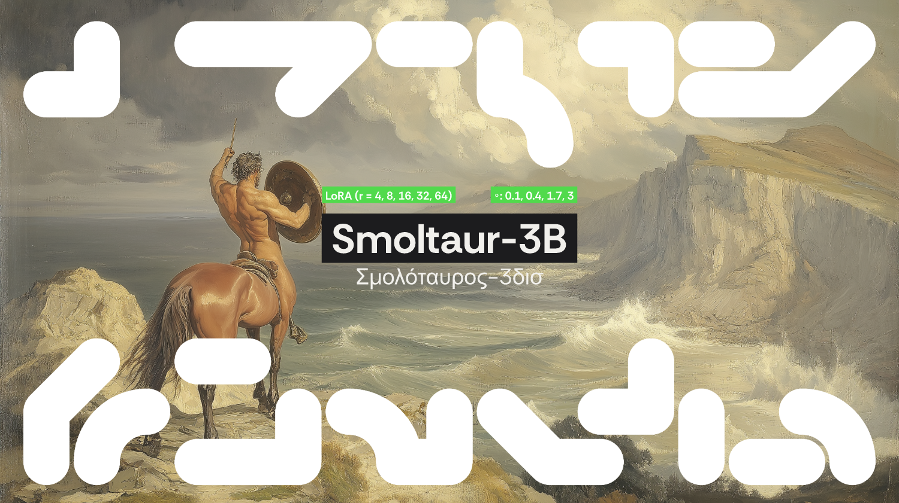

<div align="center">
  

  [![socius](https://img.shields.io/badge/Models-socius-00002E?logo=data:image/svg%2bxml;base64,PHN2ZyB3aWR0aD0iMzAwIiBoZWlnaHQ9IjMwMCIgdmlld0JveD0iMCAwIDMwMCAzMDAiIGZpbGw9Im5vbmUiIHhtbG5zPSJodHRwOi8vd3d3LnczLm9yZy8yMDAwL3N2ZyI+CjxwYXRoIGZpbGwtcnVsZT0iZXZlbm9kZCIgY2xpcC1ydWxlPSJldmVub2RkIiBkPSJNMTkxIDQyQzE5MSAzNC44MjAzIDE5Ni44MiAyOSAyMDQgMjlMMjU4IDI5QzI2NS4xOCAyOSAyNzEgMzQuODIwMyAyNzEgNDJDMjcxIDQ5LjE3OTcgMjY1LjE4IDU1IDI1OCA1NUwyMDQgNTVDMTk2LjgyIDU1IDE5MSA0OS4xNzk3IDE5MSA0MloiIGZpbGw9IiNGMUYwRUMiLz4KPHBhdGggZmlsbC1ydWxlPSJldmVub2RkIiBjbGlwLXJ1bGU9ImV2ZW5vZGQiIGQ9Ik00MiAxMDlDMzQuODIwMyAxMDkgMjkgMTAzLjE4IDI5IDk2TDI5IDQyQzI5IDM0LjgyMDMgMzQuODIwMyAyOSA0MiAyOUM0OS4xNzk3IDI5IDU1IDM0LjgyMDMgNTUgNDJMNTUgOTZDNTUgMTAzLjE4IDQ5LjE3OTcgMTA5IDQyIDEwOVoiIGZpbGw9IiNGMUYwRUMiLz4KPHBhdGggZmlsbC1ydWxlPSJldmVub2RkIiBjbGlwLXJ1bGU9ImV2ZW5vZGQiIGQ9Ik0yNTggMTkxQzI2NS4xOCAxOTEgMjcxIDE5Ni44MiAyNzEgMjA0TDI3MSAyNThDMjcxIDI2NS4xOCAyNjUuMTggMjcxIDI1OCAyNzFDMjUwLjgyIDI3MSAyNDUgMjY1LjE4IDI0NSAyNThMMjQ1IDIwNEMyNDUgMTk2LjgyIDI1MC44MiAxOTEgMjU4IDE5MVoiIGZpbGw9IiNGMUYwRUMiLz4KPHBhdGggZmlsbC1ydWxlPSJldmVub2RkIiBjbGlwLXJ1bGU9ImV2ZW5vZGQiIGQ9Ik0xMDkgMjU4QzEwOSAyNjUuMTggMTAzLjE4IDI3MSA5NiAyNzFMNDIgMjcxQzM0LjgyMDMgMjcxIDI5IDI2NS4xOCAyOSAyNThDMjkgMjUwLjgyIDM0LjgyMDMgMjQ1IDQyIDI0NUw5NiAyNDVDMTAzLjE4IDI0NSAxMDkgMjUwLjgyIDEwOSAyNThaIiBmaWxsPSIjRjFGMEVDIi8+CjxwYXRoIGZpbGwtcnVsZT0iZXZlbm9kZCIgY2xpcC1ydWxlPSJldmVub2RkIiBkPSJNMjkgOTZDMjkgODguODIwMyAzNC44MjAzIDgzIDQyIDgzTDk2IDgzQzEwMy4xOCA4MyAxMDkgODguODIwMyAxMDkgOTZDMTA5IDEwMy4xOCAxMDMuMTggMTA5IDk2IDEwOUw0MiAxMDlDMzQuODIwMyAxMDkgMjkgMTAzLjE4IDI5IDk2WiIgZmlsbD0iI0YxRjBFQyIvPgo8cGF0aCBmaWxsLXJ1bGU9ImV2ZW5vZGQiIGNsaXAtcnVsZT0iZXZlbm9kZCIgZD0iTTIwNCA4M0MyMTEuMTggODMgMjE3IDg4LjgyMDMgMjE3IDk2TDIxNyAxNTBDMjE3IDE1Ny4xOCAyMTEuMTggMTYzIDIwNCAxNjNDMTk2LjgyIDE2MyAxOTEgMTU3LjE4IDE5MSAxNTBMMTkxIDk2QzE5MSA4OC44MjAzIDE5Ni44MiA4MyAyMDQgODNaIiBmaWxsPSIjRjFGMEVDIi8+CjxwYXRoIGZpbGwtcnVsZT0iZXZlbm9kZCIgY2xpcC1ydWxlPSJldmVub2RkIiBkPSJNMjcxIDIwNEMyNzEgMjExLjE4IDI2NS4xOCAyMTcgMjU4IDIxN0wyMDQgMjE3QzE5Ni44MiAyMTcgMTkxIDIxMS4xOCAxOTEgMjA0QzE5MSAxOTYuODIgMTk2LjgyIDE5MSAyMDQgMTkxTDI1OCAxOTFDMjY1LjE4IDE5MSAyNzEgMTk2LjgyIDI3MSAyMDRaIiBmaWxsPSIjRjFGMEVDIi8+CjxwYXRoIGZpbGwtcnVsZT0iZXZlbm9kZCIgY2xpcC1ydWxlPSJldmVub2RkIiBkPSJNOTYgMjE3Qzg4LjgyMDMgMjE3IDgzIDIxMS4xOCA4MyAyMDRMODMgMTUwQzgzIDE0Mi44MiA4OC44MjAzIDEzNyA5NiAxMzdDMTAzLjE4IDEzNyAxMDkgMTQyLjgyIDEwOSAxNTBMMTA5IDIwNEMxMDkgMjExLjE4IDEwMy4xOCAyMTcgOTYgMjE3WiIgZmlsbD0iI0YxRjBFQyIvPgo8cGF0aCBmaWxsLXJ1bGU9ImV2ZW5vZGQiIGNsaXAtcnVsZT0iZXZlbm9kZCIgZD0iTTI1OCA4M0MyNjUuMTggODMgMjcxIDg4LjgyMDMgMjcxIDk2QzI3MSAxMzMuMDAyIDI0MS4wMDIgMTYzIDIwNCAxNjNDMTk2LjgyIDE2MyAxOTEgMTU3LjE4IDE5MSAxNTBDMTkxIDE0Mi44MiAxOTYuODIgMTM3IDIwNCAxMzdDMjI2LjY0MiAxMzcgMjQ1IDExOC42NDIgMjQ1IDk2QzI0NSA4OC44MjAzIDI1MC44MiA4MyAyNTggODNaIiBmaWxsPSIjRjFGMEVDIi8+CjxwYXRoIGZpbGwtcnVsZT0iZXZlbm9kZCIgY2xpcC1ydWxlPSJldmVub2RkIiBkPSJNODMgNDJDODMgMzQuODIwMyA4OC44MjAzIDI5IDk2IDI5QzEzMy4wMDIgMjkgMTYzIDU4Ljk5ODEgMTYzIDk2QzE2MyAxMDMuMTggMTU3LjE4IDEwOSAxNTAgMTA5QzE0Mi44MiAxMDkgMTM3IDEwMy4xOCAxMzcgOTZDMTM3IDczLjM1NzUgMTE4LjY0MiA1NSA5NiA1NUM4OC44MjAzIDU1IDgzIDQ5LjE3OTcgODMgNDJaIiBmaWxsPSIjRjFGMEVDIi8+CjxwYXRoIGZpbGwtcnVsZT0iZXZlbm9kZCIgY2xpcC1ydWxlPSJldmVub2RkIiBkPSJNMjE3IDI1OEMyMTcgMjY1LjE4IDIxMS4xOCAyNzEgMjA0IDI3MUMxNjYuOTk4IDI3MSAxMzcgMjQxLjAwMiAxMzcgMjA0QzEzNyAxOTYuODIgMTQyLjgyIDE5MSAxNTAgMTkxQzE1Ny4xOCAxOTEgMTYzIDE5Ni44MiAxNjMgMjA0QzE2MyAyMjYuNjQyIDE4MS4zNTggMjQ1IDIwNCAyNDVDMjExLjE4IDI0NSAyMTcgMjUwLjgyIDIxNyAyNThaIiBmaWxsPSIjRjFGMEVDIi8+CjxwYXRoIGZpbGwtcnVsZT0iZXZlbm9kZCIgY2xpcC1ydWxlPSJldmVub2RkIiBkPSJNNDIgMjE3QzM0LjgyMDMgMjE3IDI5IDIxMS4xOCAyOSAyMDRDMjkgMTY2Ljk5OCA1OC45OTgyIDEzNyA5NiAxMzdDMTAzLjE4IDEzNyAxMDkgMTQyLjgyIDEwOSAxNTBDMTA5IDE1Ny4xOCAxMDMuMTggMTYzIDk2IDE2M0M3My4zNTc2IDE2MyA1NSAxODEuMzU4IDU1IDIwNEM1NSAyMTEuMTggNDkuMTc5NyAyMTcgNDIgMjE3WiIgZmlsbD0iI0YxRjBFQyIvPgo8L3N2Zz4K&logoColor=white)](https://huggingface.co/socius)
  [](https://huggingface.co/datasets/marcelbinz/Psych-101)
</div>

# Smoltaur

Hugging Face **SmolLM** base models fine-tuned on Psych-101 — extending the scale curve below 0.6B, down to a 0.1B model.

All sizes are trained identically with the shared pipeline: LoRA (rsLoRA, `r = 4, 8, 16, 32, 64`),
1 epoch, seed 3407, completion-only loss. Part of the [**Centauri**](../README.md) project.

## Base models

| Size | Base checkpoint | Notes |
|---|---|---|
| **0.1B** | `unsloth/SmolLM2-135M` | 8192-token context |
| **0.4B** | `unsloth/SmolLM2-360M` | 8192 |
| **1.7B** | `unsloth/SmolLM2-1.7B` | 8192 |
| **3B** | `unsloth/SmolLM3-3B-Base` | 32768 |

## Train

```bash
# a single cell (run from the repo root)
python smoltaur/train_smoltaur.py --size 0.1B --lora_rank 16 --wandb

# the whole family sweep (rank sweep + dataset-size ablation)
python schedule_training_runs.py --family smollm
```

## Released adapters

Trained LoRA adapters and per-size collections are published under the
[`socius`](https://huggingface.co/socius) organization, named
`socius/Smoltaur-<size>-LoRA-r<rank>[-f<fraction>]`.

## License

Apache-2.0 (adapters and base models).
